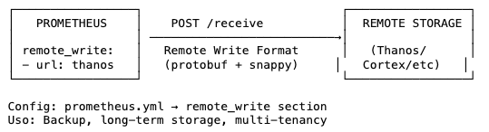
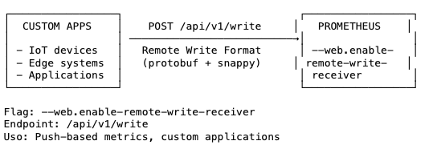
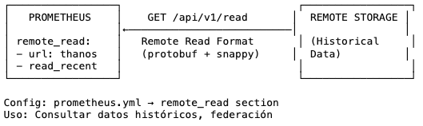
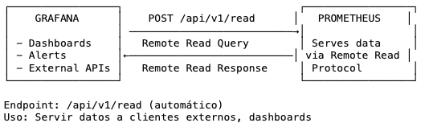

* Prometheus' storage architecture
  * built-in local on-disk time series database (TSDB)
  * support integration -- with -- remote storage systems

## Local storage

### On-disk layout

* ingested samples
  * 👀grouped | blocks of 2 hours👀

* 2-hour block == directory / has 👀chunks subdirectory + ALL time series samples | 2 hours + metadata file + index file👀
  * samples | chunks directory
    * grouped | >=1 segment files / <= 512MB
  * if series are deleted via the API -> deletion records are stored | separate tombstone files

* CURRENT block for incoming samples
  * ⚠️kept in memory⚠️
    * Reason:🧠's speed >> disk memory🧠
  * NOT FULLY persisted
    * AFTER 2 hours + compact + organize,
      * it's persisted
  * secured against crashes -- by a -- write-ahead log (WAL)
    * -> | restart Prometheus server, can be replayed 

* Write-ahead log files
  * stored | `wal` directory | 128MB segments
  * == raw data / NOT yet compacted
    * -> 's size > regular block files
  * Prometheus retain >= 3 WAL files
    * if there is high-traffic -> retain > 3 WAL files / keep > 2 hours of raw data

* Prometheus server's data directory

    ```
    ./data
    ├── 01BKGV7JBM69T2G1BGBGM6KB12
    │   └── meta.json
    ├── 01BKGTZQ1SYQJTR4PB43C8PD98
    │   ├── chunks
    │   │   └── 000001
    │   ├── tombstones
    │   ├── index
    │   └── meta.json
    ├── 01BKGTZQ1HHWHV8FBJXW1Y3W0K
    │   └── meta.json
    ├── 01BKGV7JC0RY8A6MACW02A2PJD
    │   ├── chunks
    │   │   └── 000001
    │   ├── tombstones
    │   ├── index
    │   └── meta.json
    ├── chunks_head
    │   └── 000001
    └── wal
        ├── 000000002
        └── checkpoint.00000001
            └── 00000000
    ```
  * [TSDB format](/prometheus/tsdb/docs/format/README.md)

* local storage's restriction
  * NOT clustered or replicated
    * Reason:🧠Prometheus runs as standalone server🧠
    * -> ❌NOT arbitrarily scalable OR durable❌
    * Solution:💡
      * [federation](federation.md)
      * [remote storage](#remote-storage-integrations)💡

* [Snapshots](querying/api.md#snapshot)
  * uses
    * backups

* Backups / 
  * WITHOUT snapshots
    * == 👀ALREADY persisted👀
    * risk
      * lose data / was recorded since the last WAL sync (EACH 2 hours)
  * proper architecture,
    * can retain years of data | local storage
      ```
      --storage.tsdb.retention.time=5y
      --storage.tsdb.retention.size=1TB
      ```

### Compaction

* FIRST 2-hour blocks
  * eventually compacted | larger blocks

* Compaction
  * == 👀create larger blocks / contain data <= 10% of retention time OR 31 days👀
    * _Example:_ if retention is 15 days -> 10% of 15 days = 1.5 days -> blocks / contain 1.5 days
    * -> 
      * less files
      * better compression
      * faster queries

### Operational aspects

* Prometheus's local storage flags
  - `--storage.tsdb.path`
    - path | Prometheus writes its database
    - by default, | `data/`
  - `--storage.tsdb.retention.time`
    - == how long to retain samples | storage
    - if NOT specified this flag NOR `storage.tsdb.retention.size` -> retention time == `15d`
    - supported units: y, w, d, h, m, s, ms
  - `--storage.tsdb.retention.size`
    - == maximum number of bytes of storage blocks
      - -- based on -- powers-of-2
        - _Example:_ 1KB == 1024B
      - == 💡desired retention + WAL + chunks_head💡
        - Reason:🧠WAL & chunks_head are NEVER deleted AUTOMATICALLY🧠 
      - the oldest persistent data will be removed FIRST
    - by default, `0` OR disabled
    - supported units: B, KB, MB, GB, TB, PB, EB
  - `--storage.tsdb.wal-compression`
    - enables compression of WAL
    - -> halve WAL size
      - Reason:🧠remove duplications🧠
    - little extra cpu load impact
    - | Prometheus
      - v2.11.0,
        - introduced
        - if you want to use SUDDENLY lower version -> you need to delete WAL 
      - v2.20.0,
        - enabled by default 

* Prometheus
  * sample's size == 1-2 bytes
  * server required disk space formula

    ```
    needed_disk_space = retention_time_seconds * ingested_samples_per_second * bytes_per_sample
    
    # retention_time_seconds == how long to retain data
    ```
    * ingested_samples_per_second
      * ways to lower
        * reduce the number of time series / you scrape
        * increase the scrape interval

* if your local storage becomes corrupted / Prometheus does NOT start
  * ALTERNATIVES
    * backup the storage directory & restore the corrupted block directories -- from -- your backups
    * if you do NOT have backups -> remove the corrupted files (individual block directories, WAL)

* filesystems / for Prometheus' local storage
  * NOT supported
    * Non-POSIX compliant filesystems
      * Reason:🧠unrecoverable corruptions may happen🧠
    * NFS filesystems (including AWS's EFS)
      * Reason:🧠MOST implementations are NOT POSIX-compliant🧠
  * supported
    * POSIX compliant filesystems

* if `--storage.tsdb.retention.time` `--storage.tsdb.retention.size` are specified -> whichever triggers FIRST is used

* Expired block cleanup
  * removed | background
    * may take <= 2 hours

### Right-Sizing Retention Size

If you are utilizing `storage.tsdb.retention.size` to set a size limit, you
will want to consider the right size for this value relative to the storage you
have allocated for Prometheus. It is wise to reduce the retention size to provide
a buffer, ensuring that older entries will be removed before the allocated storage
for Prometheus becomes full.

At present, we recommend setting the retention size to, at most, 80-85% of your
allocated Prometheus disk space. This increases the likelihood that older entries
will be removed prior to hitting any disk limitations.

## Remote storage integrations

* Prometheus's local storage limitation
  * ⚠️1! node's scalability & durability⚠️
    * 1! 
      * != distributed storage
      * != clustered storage

### Overview

* ways / Prometheus integrates with remote storage systems
  - Prometheus write samples / it ingests | remote URL -- via -- [Remote Write format](https://prometheus.io/docs/specs/remote_write_spec_2_0/)
    - [remote write](configuration/configuration.md#remote_write)

        

  - Prometheus receive OTHER clients' samples -- via -- [Remote Write format](https://prometheus.io/docs/specs/remote_write_spec_2_0/)
    - `--web.enable-remote-write-receiver` 
    - Prometheus' receiver endpoint: /api/v1/write

      

  - Prometheus read (back) sample data from a remote URL -- via -- [Remote Read format](https://github.com/prometheus/prometheus/blob/main/prompb/remote.proto#L31)
    - [remote read](configuration/configuration.md#remote_read)

      

  - Prometheus return sample data / requested by clients -- via -- [Remote Read format](https://github.com/prometheus/prometheus/blob/main/prompb/remote.proto#L31)
    - Prometheus' receiver endpoint: /api/v1/read

      

* architecture

  

* remote read & write protocols
  * use a snappy-compressed protocol buffer encoding -- over -- HTTP
  * read protocol
    * ❌NOT YET stable❌
    * ⚠️ONLY fetches raw series data / set of label selectors & time ranges⚠️
      * ALL PromQL evaluation happens | Prometheus
      * -> ⚠️scalability limit⚠️
  * write protocol
    * [| 1.0v, stable specification](https://prometheus.io/docs/specs/remote_write_spec/)
    * [| 2.0v, experimental specification](https://prometheus.io/docs/specs/remote_write_spec_2_0/)

* `/api/v1/write`
  * remote write receiver endpoint
* [`/api/v1/read`](https://prometheus.io/docs/prometheus/latest/querying/remote_read_api/)
  * remote read endpoint 

### Existing integrations

* [Integrations documentation](https://prometheus.io/docs/operating/integrations/#remote-endpoints-and-storage)

## Backfilling from OpenMetrics format

### Overview

If a user wants to create blocks into the TSDB from data that is in
[OpenMetrics](https://openmetrics.io/) format, they can do so using backfilling.
However, they should be careful and note that it is not safe to backfill data
from the last 3 hours (the current head block) as this time range may overlap
with the current head block Prometheus is still mutating. Backfilling will
create new TSDB blocks, each containing two hours of metrics data. This limits
the memory requirements of block creation. Compacting the two hour blocks into
larger blocks is later done by the Prometheus server itself.

A typical use case is to migrate metrics data from a different monitoring system
or time-series database to Prometheus. To do so, the user must first convert the
source data into [OpenMetrics](https://openmetrics.io/) format, which is the
input format for the backfilling as described below.

Note that native histograms and staleness markers are not supported by this
procedure, as they cannot be represented in the OpenMetrics format.

### Usage

Backfilling can be used via the Promtool command line. Promtool will write the blocks
to a directory. By default this output directory is ./data/, you can change it by
using the name of the desired output directory as an optional argument in the sub-command.

```
promtool tsdb create-blocks-from openmetrics <input file> [<output directory>]
```

After the creation of the blocks, move it to the data directory of Prometheus.
If there is an overlap with the existing blocks in Prometheus, the flag
`--storage.tsdb.allow-overlapping-blocks` needs to be set for Prometheus versions
v2.38 and below. Note that any backfilled data is subject to the retention
configured for your Prometheus server (by time or size).

#### Longer Block Durations

By default, the promtool will use the default block duration (2h) for the blocks;
this behavior is the most generally applicable and correct. However, when backfilling
data over a long range of times, it may be advantageous to use a larger value for
the block duration to backfill faster and prevent additional compactions by TSDB later.

The `--max-block-duration` flag allows the user to configure a maximum duration of blocks.
The backfilling tool will pick a suitable block duration no larger than this.

While larger blocks may improve the performance of backfilling large datasets,
drawbacks exist as well. Time-based retention policies must keep the entire block
around if even one sample of the (potentially large) block is still within the
retention policy. Conversely, size-based retention policies will remove the entire
block even if the TSDB only goes over the size limit in a minor way.

Therefore, backfilling with few blocks, thereby choosing a larger block duration,
must be done with care and is not recommended for any production instances.

## Backfilling for Recording Rules

### Overview

When a new recording rule is created, there is no historical data for it.
Recording rule data only exists from the creation time on.
`promtool` makes it possible to create historical recording rule data.

### Usage

To see all options, use: `$ promtool tsdb create-blocks-from rules --help`.

Example usage:

```
$ promtool tsdb create-blocks-from rules \
    --start 1617079873 \
    --end 1617097873 \
    --url http://mypromserver.com:9090 \
    rules.yaml rules2.yaml
```

The recording rule files provided should be a normal
[Prometheus rules file](https://prometheus.io/docs/prometheus/latest/configuration/recording_rules/).

The output of `promtool tsdb create-blocks-from rules` command is a directory that
contains blocks with the historical rule data for all rules in the recording rule
files. By default, the output directory is `data/`. In order to make use of this
new block data, the blocks must be moved to a running Prometheus instance data dir
`storage.tsdb.path` (for Prometheus versions v2.38 and below, the flag
`--storage.tsdb.allow-overlapping-blocks` must be enabled). Once moved, the new
blocks will merge with existing blocks when the next compaction runs.

### Limitations

- If you run the rule backfiller multiple times with the overlapping start/end times,
  blocks containing the same data will be created each time the rule backfiller is run.
- All rules in the recording rule files will be evaluated.
- If the `interval` is set in the recording rule file that will take priority over
  the `eval-interval` flag in the rule backfill command.
- Alerts are currently ignored if they are in the recording rule file.
- Rules in the same group cannot see the results of previous rules. Meaning that rules
  that refer to other rules being backfilled is not supported. A workaround is to
  backfill multiple times and create the dependent data first (and move dependent
  data to the Prometheus server data dir so that it is accessible from the Prometheus API).
