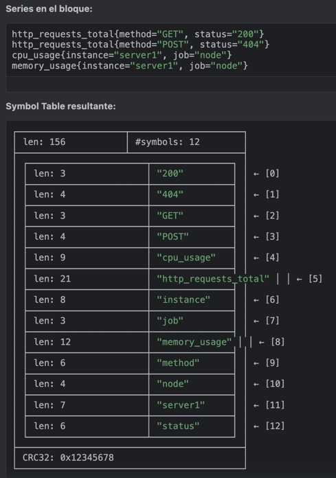
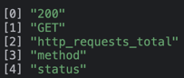
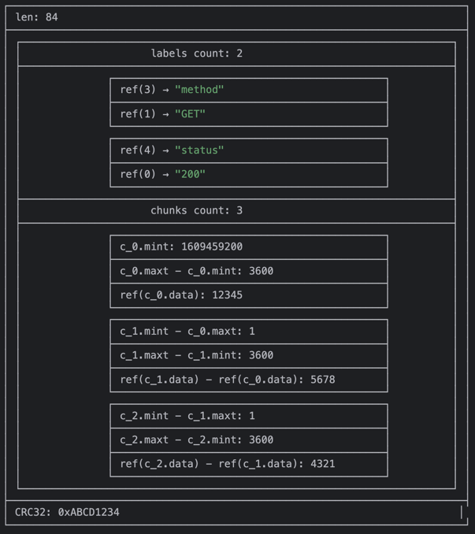
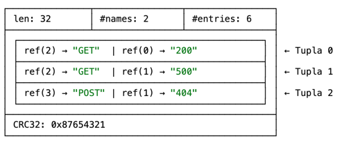
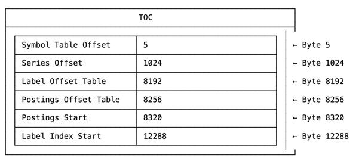

# Index Disk Format

* goal
  * `index` file | EACH block TSDB

* `index` file | EACH block TSDB
  * == 👀EACH block TSDB's main index👀
  * allows
    * FAST queries WITHOUT reading ALL data

```
┌────────────────────────────┬─────────────────────┐
│ magic(0xBAAAD700) <4b>     │ version(1) <1 byte> │
├────────────────────────────┴─────────────────────┤
│ ┌──────────────────────────────────────────────┐ │
│ │                 Symbol Table                 │ │
│ ├──────────────────────────────────────────────┤ │
│ │                    Series                    │ │
│ ├──────────────────────────────────────────────┤ │
│ │                 Label Index 1                │ │
│ ├──────────────────────────────────────────────┤ │
│ │                      ...                     │ │
│ ├──────────────────────────────────────────────┤ │
│ │                 Label Index N                │ │
│ ├──────────────────────────────────────────────┤ │
│ │                   Postings 1                 │ │
│ ├──────────────────────────────────────────────┤ │
│ │                      ...                     │ │
│ ├──────────────────────────────────────────────┤ │
│ │                   Postings N                 │ │
│ ├──────────────────────────────────────────────┤ │
│ │               Label Offset Table             │ │
│ ├──────────────────────────────────────────────┤ │
│ │             Postings Offset Table            │ │
│ ├──────────────────────────────────────────────┤ │
│ │                      TOC                     │ │
│ └──────────────────────────────────────────────┘ │
└──────────────────────────────────────────────────┘
```

* | write the index,
  * add arbitrary number of padding bytes (== extra bytes) BETWEEN the sections
* | scan the file,
  * zero bytes AFTER section's specified length -> are skipped
* MOST of the sections
  * 👀start with a `len` field👀
    * == number of bytes BEFORE the trailing CRC32 checksum

* checksum
  * calculated -- based on -- `len` bytes 
  * uses
    * check data integrity

### Symbol Table

* symbol table
  * == 👀sorted list of deduplicated strings👀 (EACH table's row) /
    * strings
      * utf-8 encoded
      * sorted -- via -- lexicographically ascending order 
    * can be referenced -- from -- subsequent sections
    * reduce the total index size
  * uses
    * 👀ALL TBSD's label pairs 👀
  * 's syntax

    ```
    ┌────────────────────┬─────────────────────┐
    │ len <4b>           │ #symbols <4b>       │
    ├────────────────────┴─────────────────────┤
    │ ┌──────────────────────┬───────────────┐ │
    │ │ len(str_1) <uvarint> │ str_1 <bytes> │ │
    │ ├──────────────────────┴───────────────┤ │
    │ │                . . .                 │ │
    │ ├──────────────────────┬───────────────┤ │
    │ │ len(str_n) <uvarint> │ str_n <bytes> │ │
    │ └──────────────────────┴───────────────┘ │
    ├──────────────────────────────────────────┤
    │ CRC32 <4b>                               │
    └──────────────────────────────────────────┘
    ```
  * _Example:_

    

### Series

* series
  * == 👀label set of the series + chunks 👀
    * sorted lexicographically -- by -- their label sets
      * allows
        * FAST queries
    * 's syntax

        ```
        ┌───────────────────────────────────────┐
        │ ┌───────────────────────────────────┐ │
        │ │   series_1                        │ │
        │ ├───────────────────────────────────┤ │
        │ │                 . . .             │ │
        │ ├───────────────────────────────────┤ │
        │ │   series_n                        │ │
        │ └───────────────────────────────────┘ │
        └───────────────────────────────────────┘
        ```

    * EACH series 
      * == EACH row
      * aligned -- to -- 16 bytes
      * ' ID == `offset/16` 
      * 's syntax

        ```
        ┌──────────────────────────────────────────────────────────────────────────┐
        │ len <uvarint>                                                            │
        ├──────────────────────────────────────────────────────────────────────────┤
        │ ┌──────────────────────────────────────────────────────────────────────┐ │
        │ │                     labels count <uvarint64>                         │ │
        │ ├──────────────────────────────────────────────────────────────────────┤ │
        │ │              ┌────────────────────────────────────────────┐          │ │
        │ │              │ ref(l_i.name) <uvarint32>                  │          │ │
        │ │              ├────────────────────────────────────────────┤          │ │
        │ │              │ ref(l_i.value) <uvarint32>                 │          │ │
        │ │              └────────────────────────────────────────────┘          │ │
        │ │                             ...                                      │ │
        │ ├──────────────────────────────────────────────────────────────────────┤ │
        │ │                     chunks count <uvarint64>                         │ │
        │ ├──────────────────────────────────────────────────────────────────────┤ │
        │ │              ┌────────────────────────────────────────────┐          │ │
        │ │              │ c_0.mint <varint64>                        │          │ │
        │ │              ├────────────────────────────────────────────┤          │ │
        │ │              │ c_0.maxt - c_0.mint <uvarint64>            │          │ │
        │ │              ├────────────────────────────────────────────┤          │ │
        │ │              │ ref(c_0.data) <uvarint64>                  │          │ │
        │ │              └────────────────────────────────────────────┘          │ │
        │ │              ┌────────────────────────────────────────────┐          │ │
        │ │              │ c_i.mint - c_i-1.maxt <uvarint64>          │          │ │
        │ │              ├────────────────────────────────────────────┤          │ │
        │ │              │ c_i.maxt - c_i.mint <uvarint64>            │          │ │
        │ │              ├────────────────────────────────────────────┤          │ │
        │ │              │ ref(c_i.data) - ref(c_i-1.data) <varint64> │          │ │
        │ │              └────────────────────────────────────────────┘          │ │
        │ │                             ...                                      │ │
        │ └──────────────────────────────────────────────────────────────────────┘ │
        ├──────────────────────────────────────────────────────────────────────────┤
        │ CRC32 <4b>                                                               │
        └──────────────────────────────────────────────────────────────────────────┘
        ```
      * `mint`
        * == chunks minimum timestamp
        * 's requirements
          * `c_i.mint` < `c_i-1.maxt`
      * `maxt`
        * == chunks maximum timestamp
      * `ref()`
        * == reference to its position | chunk file
      * `c_x`
        * == chunk x
      * `c_i.mint - c_i-1.maxt`
        * == chunk i's mint - chunk (i-1)'s maxt 
          * == timestamp range data
        * allows
          * 👀querying desired chunks -- WITHOUT -- accessing NOT desired chunks👀

* _Example:_
  * serie `http_requests_total{method="GET", status="200"}`
  * symbol table

    
  * 1 serie's structure

    

### Label Index

* label index section
  * indexes the existing (combined) values / >=1 label names
  * `#names` field
    * == number of indexed label names 
  * `#entries` field
    * == total number of entries 
  * 's body
    * == tuples of [symbol table references](#symbol-table) /
      * sorted lexicographically / increasing order
  * ❌NO longer used❌

    ```
    ┌───────────────┬────────────────┬────────────────┐
    │ len <4b>      │ #names <4b>    │ #entries <4b>  │
    ├───────────────┴────────────────┴────────────────┤
    │ ┌─────────────────────────────────────────────┐ │
    │ │ ref(value_0) <4b>                           │ │
    │ ├─────────────────────────────────────────────┤ │
    │ │ ...                                         │ │
    │ ├─────────────────────────────────────────────┤ │
    │ │ ref(value_n) <4b>                           │ │
    │ └─────────────────────────────────────────────┘ │
    │                      . . .                      │
    ├─────────────────────────────────────────────────┤
    │ CRC32 <4b>                                      │
    └─────────────────────────────────────────────────┘
    ```

    ```
    ┌────┬───┬───┬──────────────┬──────────────┬──────────────┬──────────────┬───────┐
    │ 24 │ 1 │ 4 │ ref(value_0) | ref(value_1) | ref(value_2) | ref(value_3) | CRC32 |
    └────┴───┴───┴──────────────┴──────────────┴──────────────┴──────────────┴───────┘
    ```



### Postings

* TODO:
Postings sections store monotonically increasing lists of series references that contain a given label pair associated with the list.

```
┌────────────────────┬────────────────────┐
│ len <4b>           │ #entries <4b>      │
├────────────────────┴────────────────────┤
│ ┌─────────────────────────────────────┐ │
│ │ ref(series_1) <4b>                  │ │
│ ├─────────────────────────────────────┤ │
│ │ ...                                 │ │
│ ├─────────────────────────────────────┤ │
│ │ ref(series_n) <4b>                  │ │
│ └─────────────────────────────────────┘ │
├─────────────────────────────────────────┤
│ CRC32 <4b>                              │
└─────────────────────────────────────────┘
```

The sequence of postings sections is finalized by a [postings offset table](#postings-offset-table) containing postings offset entries that points to the beginning of each postings section for a given label pair.

### Label Offset Table

A label offset table stores a sequence of label offset entries.
Every label offset entry holds the label name and the offset to its values in the label index section.
They are used to track label index sections. This is no longer used.

```
┌─────────────────────┬──────────────────────┐
│ len <4b>            │ #entries <4b>        │
├─────────────────────┴──────────────────────┤
│ ┌────────────────────────────────────────┐ │
│ │  n = 1 <1b>                            │ │
│ ├──────────────────────┬─────────────────┤ │
│ │ len(name) <uvarint>  │ name <bytes>    │ │
│ ├──────────────────────┴─────────────────┤ │
│ │  offset <uvarint64>                    │ │
│ └────────────────────────────────────────┘ │
│                    . . .                   │
├────────────────────────────────────────────┤
│  CRC32 <4b>                                │
└────────────────────────────────────────────┘
```


### Postings Offset Table

A postings offset table stores a sequence of postings offset entries, sorted by label name and value.
Every postings offset entry holds the label name/value pair and the offset to its series list in the postings section.
They are used to track postings sections. They are partially read into memory when an index file is loaded.

```
┌─────────────────────┬──────────────────────┐
│ len <4b>            │ #entries <4b>        │
├─────────────────────┴──────────────────────┤
│ ┌────────────────────────────────────────┐ │
│ │  n = 2 <1b>                            │ │
│ ├──────────────────────┬─────────────────┤ │
│ │ len(name) <uvarint>  │ name <bytes>    │ │
│ ├──────────────────────┼─────────────────┤ │
│ │ len(value) <uvarint> │ value <bytes>   │ │
│ ├──────────────────────┴─────────────────┤ │
│ │  offset <uvarint64>                    │ │
│ └────────────────────────────────────────┘ │
│                    . . .                   │
├────────────────────────────────────────────┤
│  CRC32 <4b>                                │
└────────────────────────────────────────────┘
```


### TOC

* == table of contents
* uses
  * entry point -- to the -- entire index
* points -- to -- various sections | file
  * if a reference == 0 -> respective section does NOT exist

```
┌─────────────────────────────────────────┐
│ ref(symbols) <8b>                       │
├─────────────────────────────────────────┤
│ ref(series) <8b>                        │
├─────────────────────────────────────────┤
│ ref(label indices start) <8b>           │
├─────────────────────────────────────────┤
│ ref(label offset table) <8b>            │
├─────────────────────────────────────────┤
│ ref(postings start) <8b>                │
├─────────────────────────────────────────┤
│ ref(postings offset table) <8b>         │
├─────────────────────────────────────────┤
│ CRC32 <4b>                              │
└─────────────────────────────────────────┘
```

* _Example:_

    