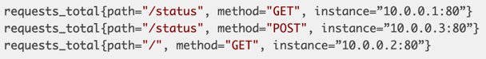
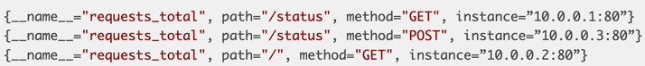
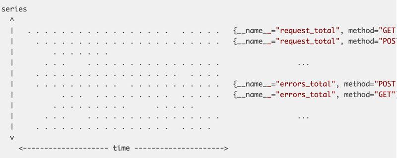

https://web.archive.org/web/20210803115658/https://fabxc.org/tsdb/

* goal
  * Writing a Time Series Database from Scratch

* Prometheus
  * == monitoring system /
    * == custom time series database (TSDB) + its well-integration with Kubernetes
      * Reason why well-integrations with Kubernetes: 🧠query language + operational model🧠
  * use cases
    * workloads MORE dynamic
      * _Example:_ ephemeral containers, automatic auto-scaling, distributed microservices, ...
      * cons
        * ⚠️performance problems (MORE memory, MORE storage, ...) -> impacts monitoring system⚠️
      * 👀handled pretty well by Prometheus👀
        * 1! Prometheus’s server can ingest
          * \< 1 million samples / second
          * \>1 million time series / occupy small amount of disk space
  * 's storage
    * CURRENT,
      * SOME inefficiencies
    * PROPOSAL,
      * NEW designed storage subsystem / 
        * corrects inefficiencies
        * handle NEXT order of scale

# CURRENT problems
## Time series data
* 👀collects data points -- over -- time👀
  * EACH data point == timestamp + value
    * timestamp == integer
    * value == number
      * 64-bit float value
        * good use cases
          * counter
          * gauge values 

* series
  * == sequence of data points / strictly monotonically increasing timestamps
  * 's identifier
    * == metric name + dictionary of label dimensions
      * Reason of label dimensions:🧠
        * 1 metric name == big container
        * EACH label partitions the container == 1 unique time series🧠
      * metric name
        * == ANOTHER label dimension

          

          

## Vertical & Horizontal
* 👀ALL data points can be laid out | 2D plane👀
  * 's horizontal dimension
    * == time
  * 's vertical dimension
    * == series identifier

* target
  * == entity / is scraped
  * 's samples are ingested INDEPENDENTLY

* At the scale of collecting millions of data points per second, batching writes is a non-negotiable performance requirement
* Writing single data points scattered across our disk would be painfully slow
* Thus, we want to write larger chunks of data in sequence.

## TODO: